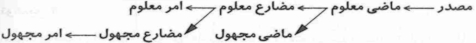
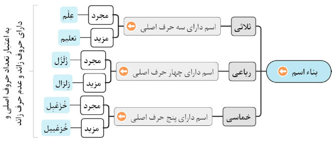

# 🅰️ تعریف

اسم: کلمه‌ای که معنای مستقلی داشته و وابسته به زمان سه‌گانه(گذشته، حال، آینده) نباشد. مثل: کتاب، اسد

* نشانه‌های اسم:
    1. الف و لام یعنی ال داشته‌باشد(المُعَلِم،الصَّف(کلاس))
    2. هر کلمه‌ای که آخر آن تنوین داشته‌باشد(مُعَلِمٌ، تلمیذٍ)
    3. هر کلمه که آخر آن ة باشد(مزرعة، حدیقة)
    4. کلمه‌ای که مستقیماً بعد از حروف جَر (فی، الَی، مِن) بیاید(الایمان فی قلبِ و ...)
    5. سه‌حرفی که حرکت حرف وسط آن ساکن باشد(عِلم، فِکر)
    6. هر کلمه‌ای که با «مُ» شروع شود(مُومن، مُجتهد، مُکاتبة)

# 🅰️ اسم مصدر

مصدر: صرفا برای ترسیمِ انجام فعل ، بدون درنظر گرفتن «زمان» و «فاعل» و «مفعول» و «سایرنقش‌ها» استفاده می‌شود

* مصدر حاوی ماده فعل است
* فعل از مصدر ساخته می‌شود.
* آنچه مستقیماً از مصدر گرفته می‌شود فعل«ماضی‌معلوم» است
* در عربی افعال معدودی وجود دارند که مصدر مستعمل(قابل استفاده) ندارند. مثل: عَسی(امید است) از مصدر «اَلْعَسی»
* مثال:
    1. ذَهاب←رفتن
    2. عِلْم←دانستن
    3. بُرْء←خوب‌شدن

# 🅰️ بناء

بناء: وضعیت اسم با توجه به تعداد حروف اصلی و زائد

* اسم از نظر بناء در6 حالت «ثلاثی» یا «رباعی» یا «خماسی» (با توجه به مجرد و مزید) است
    * ثلاثی: اسم با سه حرف اصلی
        * 1️⃣️ ثلاثی‌مجرد: اسمی که از سه حرف تشکیل شده باشد
        * اسم «ثلاثی مجرد» بر ده وزن هستند: ۱-«فَعل» مثل فَلس ۲-«فَعَل» مثل فَرَس ۳-«فَعِل» مثل کَتِف ۴-«فَعُل» مثل عَضُد ۵-«فِعْل» مثل حِبْر ۶-«فِعَل» مثل عِنَب۷-«فِعِل» مثل إبِل ۸-«فُعْل» مثل قُفْل ۹-«فُعَل» مثل صُرَد۱۰-«فُعُل» مثل عُنُق
        * 2️⃣️ ثلاثی‌مزید : اسمی که ساختار آن دارای حرف زائد علاوه بر سه حرف اصلی باشد
    * رباعی: اسم با چهار حرف اصلی
        * 3️⃣️رباعی مجرد: اسمی که ازچهار حرف تشکیل شده باشد
        * اسم «رباعی مجرد» بر شش وزن است: ۱-«فَعْلَل» مثل جَعْفَر ۲-«فِعْلِل» مثل زِبْرِج ۳-«فُعْلُل» مثل بُرْثُن ۴-«فِعْلَل» مثل دِرْهَم ۵-«فِعَلّ» مثل قِمَطْر ۶-«فُعْلَل» مثل جُخْدَب
        * 4️⃣️ رباعی مزید: اسمی که ساختار آن دارای حرف زائد علاوه بر چهار حرف اصلی باشد
    * اسم خماسی: اسمی که دارای پنچ حرف اصلی
        * ️5️⃣️ اسم خماسی مجرد: اسمی که ازپنج حرف تشکیل شده باشد
        * اسم «خماسی مجرد» بر چهار وزن است:‌۱-«فَعَلَّل» مثل سَفَرْجَل ۲-«فَعْلَلِل» مثل جَحْمَرِش ۳-«فِعْلَلّ» مثل قِرْطَعب۴-«فُعَلِّل» مثل قُذَعْمِل
        * 6️⃣️ اسم خماسی مزید: اسمی که ساختار آن دارای حرف زائد علاوه بر پنج حرف اصلی باشد

# 🅰️ مونث

* «مونث‌حقیقی»: علامت تأنیث(✅) + جان‌دار(✅)
* «مونث‌مجازی»: علامت تأنیث(✅) + جان‌دار(❌️)
* «مونث‌لفظی»:  علامت تأنیث(✅) + دلالت‌بر مونث(❌️) ← مثل: مُعَاوِيَة، زَكَرِيَاء، موسَى
* «مونث‌معنوی»: علامت تأنیث (❌️) + دلالت‌بر مونث(✅) + دلالت بر جاندار و غیرجاندار ← مثل: مَرْيَم، شَمْس، دَار، ايرَان
    1. اسامی علم مؤنث (اسم خاص زن) ← مَرْیَم، زِینَب
    2. اسامی مخصوص مؤنث ← أُم: مادر، بِنْت: دختر، أُخْت: خواهر
    3. اسامی شهر‌ها و کشورها و قبیله‌ها ← اِیرَان، مَشْهَد، قُرَیْش
    4. اغلب اعضای زوج بدن← رِجْل، یَد، عَین، أُذُن
    5. برخی اسامی که یادگیری آنان سماعی است ← أَرْض، نَار، دَار

## علامت‌های تانیث(اسم‌مونت)

1. به «ة» ختم شود مثل «مُعَلٍمَة»، «مَدرِسَة»
2. به «اء» ختم شود مثل «زهراء» ، «صحراء»
3. به «ا ، ی» ختم شود مثل «دُنیا» ، «کبری» ، «عُظْمی»
4. اندام‌های زوج بدن: «عَین» ، «یَد» ، «رِجْل (بمعنی پا)» ، «أُذُن» و غیره
5. جمع‌های مکسر غیر انسان مانند: «طیور» ، «مزارع» ، «مساجد»
6. -اسامی اغلب «شهر‌ها» و «کشورها» و «قبیله‌ها» مثل: اصفهان، ایران، بیروت، قریش و غیره
7. -کلماتی که باید حفظ شوند:
    * «عُنُق(گردن)»-«أرض»
    * «شمس»
    * «روح»
    * «ریح»
    * «نَفْس»
    * «نار»
    * «جهنم»
    * «حَرب»
    * «دار»
    * «سماء»
    * «عصا»
    * «بِئْر(چاه)»
    * «عنکبوت»و غیره

نکته:کلماتی که دو حرف «اء» یا «ی» جزو سه حرف اصلی(ماده یا ریشه) باشد جزو مونث بحساب نمی‌آیند مثل: «دواء» ، «ماء» ، «فتی»

# 🅰️ مفرد

* اسمی که تنها بر یک نفر یا حیوان یا شیء دلالت نماید.مانند:‌«عطشان»، «عُدوان(دشمنی و تجاوز)»، «خُسران»
* نشانه: اسم مفرد هیچ علامت و نشانه خاصی ندارد. البته می‌توان گفت اگر اسمی مثنی و یا جمع نباشد، قطعاً مفرد است

# 🅰️ مثنی

اسمی که بر دو شخص یا دو حیوان یا دو شیء دلالت نماید

1. «...انِ» برای زمانی که اسم در حالت «رفع» باشد
    * جَاءَ وَلَدَانِ(دو پسربچه آمدند)
    * مُعلّمانِ
    * تلمیذانِ
    * مَزْرَعَتانِ
2. «...یْنِ» برای حالتی که اسم در وضعیت «نصب» و «جر» باشد
    * مُعلّمینِ
    * تلمیذَینِ
    * مَزْرَعَتینِ
    * حالت نصب
        * رَأَيْتُ وَلَدَيْنِ(دو پسربچه را دیدم)
    * حالت جر:
        * وَقَعَ نَظَرِي عَلَى مَشْهَدَيْنِ(نگاهم به دو صحنه افتاد)

# 🅰️ جمع

«اسم‌جمع»: اسمی است که بر گروه دلالت می‌کند و حالت مفرد ندارد مانند: شَعْب(ملت)، قوم(جماعت)

* **مذکرسالم**: مخصوص جنس نر و متعلق به انسان یا صفت انسان است
    * نشانه‌ها:در آخر آنها موارد زیر بیاید:
        1. «...ونَ» مثل: مُعلمونَ - مُسلِمونَ و غیره
        2. «...ینَ» مثل: مُعلمینَ - مُسلِمینَ و غیره
    * حالت رفع ← جَاءَ المُعَلِّمُونَ(معلم‌ها آمدند-نقش المُعَلِّمُونَ فاعل دارد)
    * حالت نصب ← رَأَيْتُ المُعَلِّمِينَ(معلم‌ها را دیدم-نقش المُعَلِّمِینَ مفعول دارد)
    * حالت جر ← سَلَّمْتُ عَلَى المُعَلِّمِينَ(به معلم‌ها سلام کردم-المُعَلِّمِینَ-نفش مجرور به حرف جر دارد)
* **مونث‌سالم**: کلمات مفرد مؤنث را با افزودن «ات» به جمع مؤنث تبدیل می‌کنیم
    * به روش زیر اقدام نمایید: طالبة ← طَالِبَات
        1. تشخیص «مفرد» بودن و «مونث» بودن یک کلمه (مانند کلمه طالبة)
        2. ۲-حذف «ة»
        3. افزودن «ات» به آخر آنها
    * حالت رفع ← جَاءَت المُعَلِّمَاتُ(معلم‌ها آمدند-المُعَلِّمَاتُ نقش فاعل دارد)
    * حالت نصب ← رَأَيْتُ المُعَلِّمَاتِ(معلم‌ها را دیدم-نقش مفعول دارد)
    * حالت جر ← سَلَّمْتُ عَلَى المُعَلِّمَاتِ(به معلم‌ها سلام کردم-نقش مجرور دارد)
    * کلماتی مثل اصوات، اوقات، ابیات، اموات و.... با اینکه به (ات) ختم شده‌اند، جمع مؤنث سالم نیستند. زیرا حرف ت در انتهای آن‌ها متعلق به خود کلمه است
* مکسر: شکل مفرد کلمه تغییر میکند و قاعده خاصی ندارد و قیاسی نیست و در وزن‌های بسیاری ساخته می‌شود. از تغییر شکل اسم مفرد به دست می‌آید. درواقع جمع مکسر، جمعی است که در آن ساختمان مفرد کلمه دچار تغییر می‌‌شود.
    * مثال‌ها
        * تلمیذ ← «تلامیذ»
        * صدیق ← «أصدقاء»
        * حقل ← «حُقول(کشتزارها)»
        * صوت ← «اصوات»
        * مَیِّت ← «اموات»
        * بَیت ← «أبیات»
        * وقت ← «اوقات»
        * أخ ← «إخوان»، «إخوَة»
        * نَفْس ← «نُفوس»، «أنفُس»
        * عَین ← «أَعیُن»، «عُیون»
        * لَون ← «ألوان(رنگ‌ها)»
        * شَابّ ← «شُبان(جوانان)»
        * حُزن ← «أحزان»
        * دین ← «ادیان»
        * غُصن ← «أغصان(شاخه‌ها)»
        * بدن ← «ابدان»
        * جدار ← «جدران»
    * نکته‌ها
        * کلمه مثنی «أَخَوانِ(دوبرادر)» را با «إخْوان(برادران)» اشتباه نکنید

نکته‌ها:

* اسم جمع مانند اسم‌های مفرد جمع بسته می‌شوند
    * شَعْب ← شُعُوب
    * قَوم ← اَقْوَام
* در اسم جمع می‌توان با اعتبار به لفظ آن، مانند اسم مفرد با آن برخورد کنیم و می‌توان با اعتبار به معنایش، به صورت جمع با آن برخورد کنیم.
    * القَوم حَضَرَ . أو القَوم حَضَرُوا(جماعت حضور یافتند)

# 🅰️ حقیقی/مجازی

* اسم حقیقی: دلالت بر جاندار می‌کند
* اسم مجازی: دلالت بر غیر جاندار می‌کند

# 🅰️ معرفه|نکره

* معرفه
    * جمله بعد از اسم معرفه بیاید آن جمله نقش حال بخود می‌گیرد یعنی جمله حالیه می‌شود
* نکره
    * جمله بعد اسم نکره به بیان صفت می‌پردازد همانند مثال [۰۰۲۰۲۲]و[۰۰۲۰۸۵]

# 🅰️ مشتق|جامد

* مشتق
    * **اشتقاق**:گرفته شدن کلمه‌ای از کلمه‌ی دیگر
    * **مشتق‌منه**: کلمات از آن مشتق شده
    * **کلمات‌متجانس**: کلماتی که با یکدیگر رابطه اشتقاق دارند
    * مثال۱
        * مشتق‌منه:«علم»
        * مشتقات: «عَلِمَ» و «یَعْلَمُ» و «اِعْلَم» و «أعلَم» و «معلِّم» و «علّامه» و «عَلیم» و «معلوم» و «عالِم» و «متعلِّم»
        * متجانس: هرکدام از کلمه‌های بالا را باهم «کلمات‌متجانس» می‌گویند
* جامد: اسم جامد:‌از کلمه ی دیگری گرفته نشده است مثل: قلم، سحاب ( ابر )، جَبَل ( کوه )، بَحر (دریا )
    * «رغد» جامد است ولی «راغِداً(اسم‌فاعل)» مشتق است

# 🅰️ اسم‌موصول

اسم‌هایی نظیر التی و الذی و ... را اسم موصول می‌گویند

* مذکر
    * مفرد: «الّذی» کسی‌که، که
    * مثنی: «اللَّذانِ» و «اللَّذَبنِ» دونفری‌که، که
    * جمع:«اللَّذینَ» کسانی‌که، که
* مونث
    * مفرد: «الَّتی» کسی‌که، که
    * مثنی: «اللَّتانِ» و «اللَّتَینِ» دونفری‌که، که
    * جمع: «اللاّتی» «اللواتی» کسانی‌که (زنان)
* نکته
    * نکته: از بین موصول‌های خاص کلمات «الذی و التی و الذین» کاربرد بیشتری دارد

# 🅰️ شرط

اسامی شرط، اسم‌هایی هستند که در ابتدای جمله شرطی می‌آیند و نیازمند فعل شرط و جواب شرط می‌باشند؛ و از معنی آن شرطی فهمیده می‌شود

* اسامی شرط عبارت‌اند از:
    * مَنْ: هرکس
    * مَا: هرچه
    * أَيْنَمَا: هرجا
    * مَهْمَا: هرطور
    * مَتَی: هرگاه
    * إِذَا: هرگاه، اگر
* تمامی اسامی شرط مبنی هستند.

# 🅰️ مبنی|معرب

* «مبنی»: با تغییر موقعیتش در داخل جمله، اعرابش تغییر نمی‌کند و همیشه ثابت است(اسم‌های کمی مبنی هستند)
    * تمامی ضمایر
    * اسم‌های موصول خاص و عام (به جز حالت مثنی)
    * اسم‌های اشاره (به جز حالت مثنی)
        * مثال۱: در هر موقعیتی (هؤلاءِ) یک اعراب ثابت دارد، چرا که یک کلمه (مبنی) است.
            * ذَهَبَ هؤلَاءِ الطُلَّاب⟵این دانش‌آموزان رفتند
            * رَأَيْتُ هؤلاءِ الطُلَّاب⟵این دانش‌آموزان را دیدم
            * سَلَّمْتُ عَلَى هؤلاءِ الطُلَّاب⟵به این دانش‌آموزان سلام کردم
    * اسم‌های استفهام
    * تمامی اسم‌های شرط
    * اعداد مرکب ۱۱ تا ۱۹
    * برخی ظرف‌ها(غالبا ظرف‌ها معرب هستند اما برخی همانند مثال روبرو مبنی هستند) ← لَدَی(نزد)-هُنَا(اینجا)-أَيْنَ(کجا)-أَمْس(دیروز)-الآن(اکنون)-لَمَّا(هنگامی‌که)-مَتَی(چه‌وقت)
    * اعراب ثابت:
        * مبنی بر ضَم ← نَحْنُ، حَيْثُ(هرکجا)
        * مبنی بر فَتْح ← أَيْنَ، هُوَ، ذَلِكَ
        * مبنی بر کَسْر ← هؤلاءِ
        * مبنی بر سُکُون:اسم‌های مبنی که به (الف، ی) ختم می‌شود، مبنی بر سکون هستند. ← هَذَا، أَنْتُمَا، أَنَا، هُمْ، عَنْ(از)
* «معرب»:با تغییر موقعیتش در داخل جمله، اعرابش تغییر می‌کند یعنی حرکات مختلفی را می‌گیرد(بیش‌تر اسامی معرب هستند). اعراب اسامی معرب به سه شکل زیر است
    1. رفع
        * يَذْهَبُ «مُحَمَّدٌ» إِلَى الجَامِعَة[محمد به دانشگاه می‌رود]⟵اعراب اسم معرب در این مثال مرفوع است
        * ذَهَبَ «المُعَلِّمُ» ⟵ معلم رف
    2. نصب
        * أُرِيدُ أَنْ أَقْرَأَ «رِسَالَةً» [می‌خواهم نامه‌ای را بخوانم] ⟵ اعراب اسم معرب در این مثال منصوب است
        * رَأَيْتُ «المُعَلِّمَ» ⟵ معلم را دیدم
    3. جر
        * سَلَّمْتُ عَلَى «أُسْتَاذِي»[به استادم سلام کردم] ⟵ اعراب اسم معرب در این مثال مجرور است
        * سَلَّمْتُ عَلَى «المُعَلِّمِ» ⟵ به معلم سلام کردم

# 🅰️

# 🅰️

