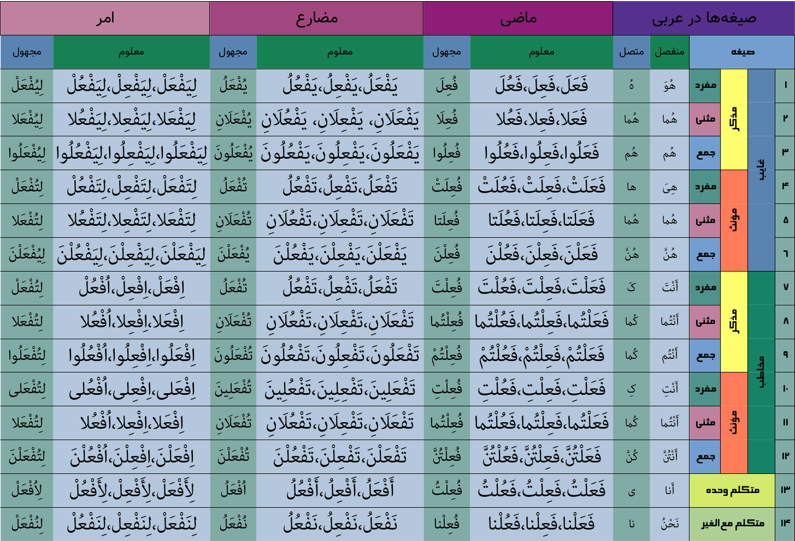
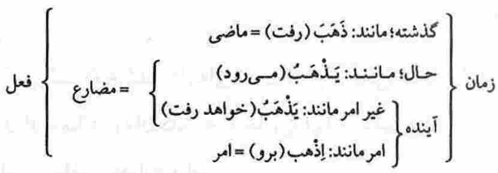
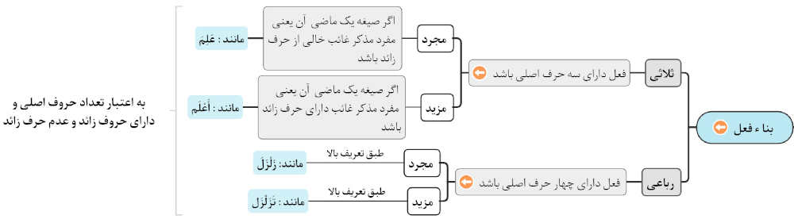

* کلمه‌ای که معنای مستقلی داشته و وابسته به زمان سه‌گانه(گذشته، حال، آینده) نباشد. مثل علم و کتاب
* در عربی فعل بر سه قسم است:
    1. ماضی: فعلی که بر انجام کار یا وقوع حالتی در زمان گذشته دلالت نماید مانند: ذَهَبّ، حَسُنَ
    2. مضارع:فعلی که برانجام کار یا وقوع حالتی در زمان حال یا آینده دلالت نماید مانند: یَذْهَبُ، یَحْسُنُ
    3. امر:فعلی که بر طلب انجام کار یا وقوع حالتی در زمان آینده دلالت نماید مانند: اِذْهَبْ، اُحْسُن
* نشانه فعل:
    1. هر کلمه که قبل از آن قَد ، س ، سوف بیاید(سنذهب، سوف نذهب)
    2. هر کلمه‌ای که آخر آن ضمایر: تَ، تِ، تُ، تْ[ت ساكن] بیاید(مثل: ذَهَبتَ، ذَهَبتِ، ذَهَبتُ، جلستْ)
    3. هیچگاه نمیتواند مجرور شود(فعل نمیتواند مضاف الیه بشود و نتیجه آن مجرور شود)
    4. هیچوقت تنوین نمی‌گیرد
    5. فعل مجرور نمی‌شود
    6. جزم برای فعل معنی دارد

---

# 🅰️بناء

بناء: وضعیت فعل با توجه به تعداد حروف اصلی و زائد

* فعل از نظر بناء در **4 حالت** «ثلاثی» یا «رباعی»(باتوجه به مجرد و مزید بودن) است و فعلی در حالت خماسی نداریم
* ثلاثی: فعل با سه‌حرف اصلی
    * ثلاثی‌مجرد: صیغه اول ماضی حرف اضافه نباشد.مثال: «کَتَبَ»، «دَرَسَ»، «ذَهَبَ»
    * ثلاثی‌مزید: افعالی که اولین صیغه ماضی آنها علاوه بر سه حرف اصلی، دارای حرف اضافه باشد(۲۵تا است که ۱۰تای آن معروف است)
* رباعی: فعل با چهار حرف اصلی
    * رباعی مجرد: صیغه اول ماضی حرف اضافه نباشد مثل «دَحْرَجَ»
    * رباعی مزید: افعالی که اولین صیغه ماضی آنها علاوه برچهار حرف اصلی، دارای حرف اضافه باشدمثل «تَدَحْرَج»

# 🅰️ثلاثی مجرد

## 🅱️ماضی

### ✅️معلوم

#### ❇️️صیغه۰۱(مفرد‌مذکر‌غایب)

1. یافتن مصدر
2. حذف حرف زائد از مصدر
3. مفتوح نمودن «فاء‌الفعل» و «لام‌الفعل»
4. متحرک نمودن «عین‌الفعل» بصورت سماعی
    * مثال۱:[مصدر ذَهاب←ذَهَبَ]
    * مثال۲:[مصدر عِلْم←عَلِمَ]
    * مثال۳:[مصدر:حُسْن←حَسُنَ]
5. یافتن «صیغه۰۱ماضی‌معلوم» که یکی از وزن‌های «فَعَلَ» یا «فَعِلَ» یا «فَعُلَ» می‌باشد
    * «فَعَلَ»←«فَعَلَ»
    * «فَعِلَ»←«فَعِلَ»
    * «فَعُلَ»←«فَعُلَ»

مثال‌ها

* نَصَرَ←یاری‌کرد[یک‌مرد]

نکات

* «فاعل» در «صیغه‌های‌غایب» می‌تواند به دو صورت آورده شود:
    1. اسم‌ظاهر:فعل خالی از ضمیر می‌شود مثل:«ذَهَبَ الرَّجُلُ»
    2. ضمیر:در «صیغه‌های۱و۴» مستتر و در چهار صیغه دیگربارز است

#### ❇️صیغه۰۲(مثنی‌مذکر‌غایب)

1. یافتن مصدر
2. -حذف حرف زائد از مصدر
3. ۳-مفتوح نمودن «فاء‌الفعل» و «لام‌الفعل»
4. ۴-متحرک نمودن «عین‌الفعل» بصورت سماعی
    * مثال۱:[مصدر ذَهاب←ذَهَبَ]
    * مثال۲:[مصدر عِلْم←عَلِمَ]
    * مثال۳:[مصدر:حُسْن←حَسُنَ]
5. ۵-یافتن «صیغه۰۱ماضی‌معلوم» که یکی از وزن‌های «فَعَلَ» یا «فَعِلَ» یا «فَعُلَ» می‌باشد
6. ۶-افزودن «الف» به آخر «صیغه۰۱ماضی‌معلوم»
    * «فَعَلَ»←«فَعَلا»
    * «فَعِلَ»←«فَعِلا»
    * «فَعُلَ»←«فَعُلا»

مثال‌ها

* نَصَرَا←یاری‌کردند[دومرد]

نکات

* «فاعل» در «صیغه‌های‌غایب» می‌تواند به دو صورت آورده شود:
    1. اسم‌ظاهر:فعل خالی از ضمیر می‌شود مثل:«ذَهَبَ الرَّجُلانِ»
    2. ضمیر:در «صیغه‌های۱و۴» مستتر و در چهار صیغه دیگربارز است

#### ❇️صیغه۰۳(جمع‌مذکر‌غایب)

1. یافتن مصدر
2. حذف حرف زائد از مصدر
3. مفتوح نمودن «فاء‌الفعل» و «لام‌الفعل»
4. متحرک نمودن «عین‌الفعل» بصورت سماعی
    * مثال۱:[مصدر ذَهاب←ذَهَبَ]
    * مثال۲:[مصدر عِلْم←عَلِمَ]
    * مثال۳:[مصدر:حُسْن←حَسُنَ]
5. یافتن «صیغه۰۱ماضی‌معلوم» که یکی از وزن‌های «فَعَلَ» یا «فَعِلَ» یا «فَعُلَ» می‌باشد
6. افزودن «واو ساکن» به آخر «صیغه۰۱ماضی‌معلوم»
7. تبدیل «لام‌الفعل» به مضموم
    * «فَعَلَ»←«فَعَلُوا»
    * «فَعِلَ»←«فَعِلُوا»
    * «فَعُلَ»←«فَعُلُوا»

مثال‌ها

* نَصَرُوا←یاری‌کردند[سه‌مرد]

نکات

* «فاعل» در «صیغه‌های‌غایب» می‌تواند به دو صورت آورده شود:
    1. اسم‌ظاهر:فعل خالی از ضمیر می‌شود مثل:«ذَهَبَ الرِّجالُ»
    2. ضمیر:در «صیغه‌های۱و۴» مستتر و در چهار صیغه دیگربارز است

#### ❇️صیغه۰۴(مفرد‌مونث‌غایب)

1. یافتن مصدر
2. حذف حرف زائد از مصدر
3. مفتوح نمودن «فاء‌الفعل» و «لام‌الفعل»
4. متحرک نمودن «عین‌الفعل» بصورت سماعی
    * مثال۱:[مصدر ذَهاب←ذَهَبَ]
    * مثال۲:[مصدر عِلْم←عَلِمَ]
    * مثال۳:[مصدر:حُسْن←حَسُنَ]
5. یافتن «صیغه۰۱ماضی‌معلوم» که یکی از وزن‌های «فَعَلَ» یا «فَعِلَ» یا «فَعُلَ» می‌باشد
6. افزودن «ت ساکن[تْ]» به آخر «صیغه۰۱ماضی‌معلوم»
    * «فَعَلَ»←«فَعَلَتْ»
    * «فَعِلَ»←«فَعِلَتْ»
    * «فَعُلَ»←«فَعُلَتْ»

مثال‌ها

* نَصَرَتْ←یاری‌کرد[یک‌زن]

نکات

* در اینجا [ت] علامت مونث بودن است
* «فاعل» در «صیغه‌های‌غایب» می‌تواند به دو صورت آورده شود:
    1. اسم‌ظاهر:فعل خالی از ضمیر می‌شود مثل:«قالَتْ هِنْدٌ»
    2. ضمیر:در «صیغه‌های۱و۴» مستتر و در چهار صیغه دیگربارز است

#### ❇️صیغه۰۵(مثنی‌مونث‌غایب)

1. یافتن مصدر
2. حذف حرف زائد از مصدر
3. مفتوح نمودن «فاء‌الفعل» و «لام‌الفعل»
4. متحرک نمودن «عین‌الفعل» بصورت سماعی
    * مثال۱:[مصدر ذَهاب←ذَهَبَ]
    * مثال۲:[مصدر عِلْم←عَلِمَ]
    * مثال۳:[مصدر:حُسْن←حَسُنَ]
5. یافتن «صیغه۰۱ماضی‌معلوم» که یکی از وزن‌های «فَعَلَ» یا «فَعِلَ» یا «فَعُلَ» می‌باشد
6. افزودن «تا» به آخر «صیغه۰۱ماضی‌معلوم»
    * «فَعَلَ»←«فَعَلَتا»
    * «فَعِلَ»←«فَعِلَتا»
    * «فَعُلَ»←«فَعُلَتا»

مثال‌ها

* نَصَرَتا←یاری‌کردند[دوزن]

نکات

* در اینجا [ت] علامت مونث بودن است
* «فاعل» در «صیغه‌های‌غایب» می‌تواند به دو صورت آورده شود:
    1. اسم‌ظاهر:فعل خالی از ضمیر می‌شود مثل:«قالَتِ المَرْأتانِ»
    2. ضمیر:در «صیغه‌های۱و۴» مستتر و در چهار صیغه دیگربارز است

#### ❇️صیغه۰۶(جمع‌مونث‌غایب)

1. یافتن مصدر
2. حذف حرف زائد از مصدر
3. مفتوح نمودن «فاء‌الفعل» و «لام‌الفعل»
4. متحرک نمودن «عین‌الفعل» بصورت سماعی
    * مثال۱:[مصدر ذَهاب←ذَهَبَ]
    * مثال۲:[مصدر عِلْم←عَلِمَ]
    * مثال۳:[مصدر:حُسْن←حَسُنَ]
5. یافتن «صیغه۰۱ماضی‌معلوم» که یکی از وزن‌های «فَعَلَ» یا «فَعِلَ» یا «فَعُلَ» می‌باشد
6. افزودن «ن مفتوح[نَ]» به آخر «صیغه۰۱ماضی‌معلوم»
7. ساکن نمودن «لام‌الفعل»
    * «فَعَلَ»←«فَعَلْنَ»
    * «فَعِلَ»←«فَعِلْنَ»
    * «فَعُلَ»←«فَعُلْنَ»

مثال‌ها

* نَصَرْنَ←یاری‌کردند[سه‌زن]

نکات

* «فاعل» در «صیغه‌های‌غایب» می‌تواند به دو صورت آورده شود:
    1. ۱-اسم‌ظاهر:فعل خالی از ضمیر می‌شود مثل:«قالَتِ النِّساءُ»
    2. ۲-ضمیر:در «صیغه‌های۱و۴» مستتر و در چهار صیغه دیگربارز است

#### ❇️صیغه۰۷(مفرد‌مذکر‌مخاطب)

1. یافتن مصدر
2. حذف حرف زائد از مصدر
3. مفتوح نمودن «فاء‌الفعل» و «لام‌الفعل»
4. متحرک نمودن «عین‌الفعل» بصورت سماعی
    * مثال۱:[مصدر ذَهاب←ذَهَبَ]
    * مثال۲:[مصدر عِلْم←عَلِمَ]
    * مثال۳:[مصدر:حُسْن←حَسُنَ]
5. یافتن «صیغه۰۱ماضی‌معلوم» که یکی از وزن‌های «فَعَلَ» یا «فَعِلَ» یا «فَعُلَ» می‌باشد
6. افزودن «ت مفتوح[تَ]» به آخر «صیغه۰۱ماضی‌معلوم»
7. ساکن نمودن «لام‌الفعل»
    * «فَعَلَ»←«فَعَلْتَ»
    * «فَعِلَ»←«فَعِلْتَ»
    * «فَعُلَ»←«فَعُلْتَ»

مثال‌ها

* نَصَرْتَ←یاری‌کردی[یک‌مرد]

نکات

* «فاعل» در «صیغه‌های‌مخاطب‌و‌متکلم» لزوما باید بصورت «ضمیر» باشد، که به آن «ضمیرحاضر» نیز گفته می‌شود

#### ❇️صیغه۰۸(مثنی‌مذکر‌مخاطب)

1. یافتن مصدر
2. حذف حرف زائد از مصدر
3. مفتوح نمودن «فاء‌الفعل» و «لام‌الفعل»
4. متحرک نمودن «عین‌الفعل» بصورت سماعی
    * مثال۱:[مصدر ذَهاب←ذَهَبَ]
    * مثال۲:[مصدر عِلْم←عَلِمَ]
    * مثال۳:[مصدر:حُسْن←حَسُنَ]
5. یافتن «صیغه۰۱ماضی‌معلوم» که یکی از وزن‌های «فَعَلَ» یا «فَعِلَ» یا «فَعُلَ» می‌باشد
6. افزودن «تُما» به آخر «صیغه۰۱ماضی‌معلوم»
7. ساکن نمودن «لام‌الفعل»
    * «فَعَلَ»←«فَعَلْتُما»
    * «فَعِلَ»←«فَعِلْتُما»
    * «فَعُلَ»←«فَعُلْتُما»

مثال‌ها

* نَصَرْتُما←یاری‌کردید[دومرد]

نکات

* «فاعل» در «صیغه‌های‌مخاطب‌و‌متکلم» لزوما باید بصورت «ضمیر» باشد، که به آن «ضمیرحاضر» نیز گفته می‌شود

#### ❇️صیغه۰۹(جمع‌مذکر‌مخاطب)

1. یافتن مصدر
2. حذف حرف زائد از مصدر
3. مفتوح نمودن «فاء‌الفعل» و «لام‌الفعل»
4. متحرک نمودن «عین‌الفعل» بصورت سماعی
    * مثال۱:[مصدر ذَهاب←ذَهَبَ]
    * مثال۲:[مصدر عِلْم←عَلِمَ]
    * مثال۳:[مصدر:حُسْن←حَسُنَ]
5. یافتن «صیغه۰۱ماضی‌معلوم» که یکی از وزن‌های «فَعَلَ» یا «فَعِلَ» یا «فَعُلَ» می‌باشد
6. افزودن «تُم» به آخر «صیغه۰۱ماضی‌معلوم»
7. ساکن نمودن «لام‌الفعل»
    * «فَعَلَ»←«فَعَلْتُمْ»
    * «فَعِلَ»←«فَعِلْتُمْ»
    * «فَعُلَ»←«فَعُلْتُمْ»

مثال‌ها

* نَصَرْتُمْ←یاری‌کردید[سه‌مرد]

نکات

* «فاعل» در «صیغه‌های‌مخاطب‌و‌متکلم» لزوما باید بصورت «ضمیر» باشد، که به آن «ضمیرحاضر» نیز گفته می‌شود

#### ❇️صیغه۱۰(مفرد‌مونث‌مخاطب)

1. یافتن مصدر
2. حذف حرف زائد از مصدر
3. مفتوح نمودن «فاء‌الفعل» و «لام‌الفعل»
4. متحرک نمودن «عین‌الفعل» بصورت سماعی
    * مثال۱:[مصدر ذَهاب←ذَهَبَ]
    * مثال۲:[مصدر عِلْم←عَلِمَ]
    * مثال۳:[مصدر:حُسْن←حَسُنَ]
5. یافتن «صیغه۰۱ماضی‌معلوم» که یکی از وزن‌های «فَعَلَ» یا «فَعِلَ» یا «فَعُلَ» می‌باشد
6. افزودن «ت مسکور[تِ]» به آخر «صیغه۰۱ماضی‌معلوم»
7. ساکن نمودن «لام‌الفعل»
    * «فَعَلَ»←«فَعَلْتِ»
    * «فَعِلَ»←«فَعِلْتِ»
    * «فَعُلَ»←«فَعُلْتِ»

مثال‌ها

* نَصَرْتِ←یاری‌کردی[یک‌زن]

نکات

* «فاعل» در «صیغه‌های‌مخاطب‌و‌متکلم» لزوما باید بصورت «ضمیر» باشد، که به آن «ضمیرحاضر» نیز گفته می‌شود

#### ❇️صیغه۱۱(مثنی‌مونث‌مخاطب)

1. یافتن مصدر
2. حذف حرف زائد از مصدر
3. مفتوح نمودن «فاء‌الفعل» و «لام‌الفعل»
4. متحرک نمودن «عین‌الفعل» بصورت سماعی
    * مثال۱:[مصدر ذَهاب←ذَهَبَ]
    * مثال۲:[مصدر عِلْم←عَلِمَ]
    * مثال۳:[مصدر:حُسْن←حَسُنَ]
5. یافتن «صیغه۰۱ماضی‌معلوم» که یکی از وزن‌های «فَعَلَ» یا «فَعِلَ» یا «فَعُلَ» می‌باشد
6. افزودن «تُما» به آخر «صیغه۰۱ماضی‌معلوم»
7. ساکن نمودن «لام‌الفعل»
    * «فَعَلَ»←«فَعَلْتُما»
    * «فَعِلَ»←«فَعِلْتُما»
    * «فَعُلَ»←«فَعُلْتُما»

مثال‌ها

* نَصَرْتُما←یاری‌کردید[دوزن]

نکات

* «فاعل» در «صیغه‌های‌مخاطب‌و‌متکلم» لزوما باید بصورت «ضمیر» باشد، که به آن «ضمیرحاضر» نیز گفته می‌شود

#### ❇️صیغه۱۲(جمع‌مونث‌مخاطب)

1. یافتن مصدر
2. حذف حرف زائد از مصدر
3. مفتوح نمودن «فاء‌الفعل» و «لام‌الفعل»
4. متحرک نمودن «عین‌الفعل» بصورت سماعی
    * مثال۱:[مصدر ذَهاب←ذَهَبَ]
    * مثال۲:[مصدر عِلْم←عَلِمَ]
    * مثال۳:[مصدر:حُسْن←حَسُنَ]
5. یافتن «صیغه۰۱ماضی‌معلوم» که یکی از وزن‌های «فَعَلَ» یا «فَعِلَ» یا «فَعُلَ» می‌باشد
6. افزودن «تُنَّ» به آخر «صیغه۰۱ماضی‌معلوم»
7. ساکن نمودن «لام‌الفعل»
    * «فَعَلَ»←«فَعَلْتُنَّ»
    * «فَعِلَ»←«فَعِلْتُنَّ»
    * «فَعُلَ»←«فَعُلْتُنَّ»

مثال‌ها

* نَصَرْتُنَّ←یاری‌کردید[سه‌زن]

نکات

* «فاعل» در «صیغه‌های‌مخاطب‌و‌متکلم» لزوما باید بصورت «ضمیر» باشد، که به آن «ضمیرحاضر» نیز گفته می‌شود

#### ❇️صیغه۱۳(متکلم‌وحده)

1. یافتن مصدر
2. حذف حرف زائد از مصدر
3. مفتوح نمودن «فاء‌الفعل» و «لام‌الفعل»
4. متحرک نمودن «عین‌الفعل» بصورت سماعی
    * مثال۱:[مصدر ذَهاب←ذَهَبَ]
    * مثال۲:[مصدر عِلْم←عَلِمَ]
    * مثال۳:[مصدر:حُسْن←حَسُنَ]
5. یافتن «صیغه۰۱ماضی‌معلوم» که یکی از وزن‌های «فَعَلَ» یا «فَعِلَ» یا «فَعُلَ» می‌باشد
6. افزودن «ت مضموم[تُ]» به آخر «صیغه۰۱ماضی‌معلوم»
7. ساکن نمودن «لام‌الفعل»
    * «فَعَلَ»←«فَعَلْتُ»
    * «فَعِلَ»←«فَعِلْتُ»
    * «فَعُلَ»←«فَعُلْتُ»

مثال‌ها

* نَصَرْتُ←یاری‌کردم[من]

نکات

* «فاعل» در «صیغه‌های‌مخاطب‌و‌متکلم» لزوما باید بصورت «ضمیر» باشد، که به آن «ضمیرحاضر» نیز گفته می‌شود

#### ❇️صیغه۱۴(متکلم‌مع‌الغیر)

1. یافتن مصدر
2. حذف حرف زائد از مصدر
3. مفتوح نمودن «فاء‌الفعل» و «لام‌الفعل»
4. متحرک نمودن «عین‌الفعل» بصورت سماعی
    * مثال۱:[مصدر ذَهاب←ذَهَبَ]
    * مثال۲:[مصدر عِلْم←عَلِمَ]
    * مثال۳:[مصدر:حُسْن←حَسُنَ]
5. یافتن «صیغه۰۱ماضی‌معلوم» که یکی از وزن‌های «فَعَلَ» یا «فَعِلَ» یا «فَعُلَ» می‌باشد
6. افزودن «نا» به آخر «صیغه۰۱ماضی‌معلوم»
7. ساکن نمودن «لام‌الفعل»
    * «فَعَلَ»←«فَعَلْنا»
    * «فَعِلَ»←«فَعِلْنا»
    * «فَعُلَ»←«فَعُلْنا»

مثال‌ها

* نَصَرْنا←یاری‌کردیم[ما]

نکات

* «فاعل» در «صیغه‌های‌مخاطب‌و‌متکلم» لزوما باید بصورت «ضمیر» باشد، که به آن «ضمیرحاضر» نیز گفته می‌شود

# 🅰️ثلاثی مزید

## 🅱️باب افتعال

* ماضی: إفْتَعَلَ
* مضارع: یَفْتَعِلُ
* امر: إفْتَعِلْ
* مصدر: إفْتِعال
    * احتجاج

1. «مطاوعه[طَوع به معنای فرمان بردن]» یعنی فاعل یک فعل، اثرفاعل فعل دیگررابپذیرد.
2. «مشارکت»: اشتراک یعنی ، دو یا چند فاعل در فعلی مشترک هستند.
    * احتجاج
3. به اختیار گرفتن چیزی یا اتخاذ چیزی(تفسیر روشن)
4. گاهی باب افتعال معانی باب مفاعله را تفهیم میکند

## 🅱️باب افعال

* ماضی: أفْعَلَ
* مضارع: یُفْعِلُ
* امر: أفْعِلْ
* مصدر: إفْعال
    * إنفاق

1. داخل شدن فاعل در زمان ،مکان یا عدد معین
    * «أعرَق زیدٌ» بمعنی «زید وارد عراق شد»
    * «فَأَصْبَحَ مِنَ الْخَاسِرِينَ» بمعنی «داخل صبح شد در حالیکه از زیانکاران بود»
    * «أَحصَدَ الزرعُ» بمعنی «وقت دِرو زراعت رسید»
2. سرعت مطرح است: انزال، اخراج، اطعام، اعلام

## 🅱️باب انفعال

* ماضی: إنْفَعَلَ
* مضارع: یَنْفَعِلُ
* امر: إنْفَعِل
* مصدر: أنْفِعال
*

1. تنها معنای این باب مطاوعه(اثرپذیری) است

## 🅱️باب تفاعل

* ماضی: تَفاعَلَ
* مضارع: یَتَفاعَلُ
* امر: تَفاعَلْ
* مصدر: تَفاعُل

1. مشارکت: فاعل بیش از یک نفر باشد.دو طرف که هیچکدام راجع نیستند و هردو مرجوع هستند(یعنی برنده ندارد)
    * تضارب: برنده ندارد
    * تشابه
    * تناقض
    * تناسب
    * تدایُن
    * [مائده۲] «تَعَاوَنُواْ عَلَى الْبرِّ وَالتَّقْوَی» بمعنی «يکديگر را در کار نيک و در تقوا ياري کنيد»
    * تباین
2. تظاهر کردن به چیزی
    * «تَمارُض» بمعنی «خود را به مریضی زدن»
    * تزاهُد: خود را به زهد زدن
    * [۰۰۹۰۳۸] «أثَّاقَلْتُمْ إِلَى الْأَرْضِ» یمعنی «به زمین سنگینی میکنید» یعنی «خودتان را ناتوان جلوه می‌دهید»

## 🅱️باب تفعل

* ماضی: تَفَعَّلَ
* مضارع: یَتَفَعَّلُ
* امر: تَفَعَّلْ
* مصدر: تَفَعُّل

1. مطاوعه: تاثیر پذیرفتن
    * «مُتِعَفِفْ(باب تفعل)»: عفت پذیری
2. خود را به کاری|زحمت انداختن
    * «تکلف»: به خود تکلیف دادن
    * «تَعقُل»: خود را به فکر کردن انداختن
    * «تَشجُع»: از خود شجاعت نشان داد
    * «تَحلُم»؛ حلم(به‌زحمت) را بر خود تحميل کرد
    * «تَزَّهُد»: مصرف در حد نیاز به اموال دنیایی و بی رغبتی به آن

* نکات
    * در تفعل هم لازم داریم و هم متعدی

## 🅱️باب تفعیل

* ماضی: فَعَّلَ
* مضارع: یُفَعِّلُ
* امر:فَعِّل
* مصدر: تَفْعیل

1. بیانگر «تدریج(طولانی بودن زمان)» است.
    * مثال: «تعلیم»، «تکثیر»، «تحمیل»، «تکمیل» که گواه بر زمان و تعداد زیاد است
2. بیانگر «تکثیر(از نظر فعل یا فاعل یا مفعول)» است
    * [یوسف۲۳] «..غَلَّقَتِ الأبواب...» یعنی «درهای زیادی را بست»
3. معنی «اخذ» می‌دهد
    * تزویج، تهدید و غیره
    * تغریر‌جاهل: کسی را به کمک جهالت خودِ او ، در ورطه گناه افکندن(درگیر گناه کردن)
4. بیانگر «وادار کردن کسی به کاری»

## 🅱️باب مفاعله

* ماضی: فاعَلَ
* مضارع: یُفاعِلُ
* امر: فاعِل
* مصدرمُفاعَلَة: فِعال [همانند کلمه قِتال]

1. مشارکت(مشارکت معنای غالبی باب مفاعلة است)
    * ضارَبَ زَیْدٌ بَکْراً ← زید بکر را زد و بکر هم زید را زد(زید و بکر با هم زد و خورد داشتند)
    * [۰۳۷۱۴۱] «فَسَاهَمَ فَکَانَ مِنَ الْمُدْحَضِينَ» بمعنی «پس قرعه انداختند و او از مغلوبين شد»
    * مُذاکَرَة
    * مُکالَمَة
    * مُکاتَبعة
    * مُناطَرَة
    * مُحاجَّة
    * مُنازَعَة
    * مُقاتَلَة

* نکته
    * [جوادی آملی] نکته۱:در بسیاری از مواقع باب مفاعلة یک طرفه اعمال می‌شود
    * [جوادی آملی]: طرفین یکی راجع و دیگری مرجوع
        * مضاربه: هردو به ضرب پرداختند و یکی برنده شد لذا یکی فاعل و دیگری مفعول

## 🅱️باب استفعال

* ماضی: إسْتَفْعَلَ
* مضارع: یَسْتَفْعِلُ
* امر: إسْتَفْعِلْ
* مصدر: إسْتِفْعال

1. «طلب و درخواست»
    * مثال: استشهاد ← که وقتی معنای طلب را برساند متعدی می شود.
    * مثال: أستَغفراللهَ :از خداوند طلب آمرزش می کنم
2. «شدت»
3. «به‌اجبار کاری به‌انجام رساندن»

# 🅰️

# 🅰️

