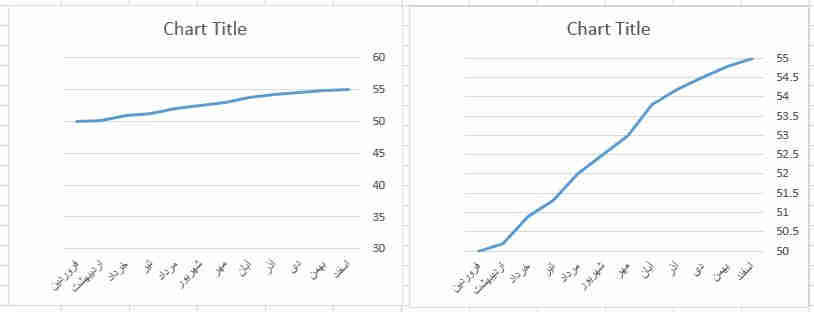

# 🅰️ مغلطه

* محدودترین تعریف مغالطه: «قیاسی است مرکب از وهمیات و مشبهات»
* قیاس فاسدی(ماده یا صورت) که منجر به نتیجه صحیح نشود
* «به طور عام مغالطه یعنی بروز خطا در فرایند تفکر»
* به طور کلی اگر خطا به صورت سهوی رخ دهد مغالطه و اگر به صورت عمدی باشد سفسطه نامیده می شود.

## 🅱️ آماری

* مثلا وقتی تعداد بسیاری حالت ساده دارد و تنها تعداد کمی حالت غیر ساده خیلی متفاوت داشته باشند
* متوسط مصرف برق در کشور بالاست.
    * این جمله در وهله اول این معنا را به ذهن متبادر می سازد که همه مردم ایران مصرف بالایی دارند در حالی که تنها 20 درصد مردم بیش از 80 درصد برق را مصرف می کنند.
* متوسط درآمد سالانه مردم ایران بیش از 10000دلار است.
    * در حالی که بیش از 75 درصد مردم کشور درآمد سالانه کمتر از 4000 دلار دارند.

## 🅱️ نمودار‌گمراه‌کننده

* استفاده از نمودارها برای بیان اطلاعات آماری با اغراض خاص
    * هر دو نمودار یک روند را نشان می دهند اما با تغییر محدوده ارقام طوری نشان می دهند. در نمودار اول گویی جهش اتفاق افتاده در حالی که نمودار دوم این را نشان نمی دهد

## 🅱️ تصاویرکم‌وزن

* در بسیاری از مواقع برای نشان دادن آمار از تصاویر به جای نمودار استفاده می شود.
    * مثلا تصاویر زیر تفاوت درآمد آسیایی ها و اروپایی ها را نشان می دهد، اما از لحاظ پیامی که منتقل می شود دو تصویر با هم یکسان نیستند.

## 🅱️ ابهام‌ساختاری

* جمله ای که می تواند به دو یا چند صورت فهمیده شود.
* ابهام در مرجع ضمیر
    * کودک تا پدرش را دید لباسش را مرتب کرد. (لباس خودش یا لباس پدرش)
    * او گفت این کتاب من است. (کتاب گوینده یا کتاب او)
* ابهام در محل مکث(نقطه یا ویرگول)
    * بخشش لازم نیست اعدامش کنید. (محل ویرگول بعد از بخشش یا بعد از نیست)
    * اجناس دزدیده شده توسط مامورین کشف شد. (ویرگول پس از شده یا پس از مامورین)
    * او برای بازدیدی، پنج روزه، از اصفهان، به تهران آمد.
* مشخص نبودن دستوری کلمه:
    * من از راهنمایی شما پشیمانم.
    * من تو را از برادرت بیشتر دوست دارم.
* مشخص نبودن تعلق صفت به مضاف یا مضاف الیه
    * جان دان، مورخ فلسفه یهودی است. (مورخ یهودی یا مورخ«فلسفه یهودی»)
* مشخص نبودن ممثل در مثال در عبارت منفی
    * من مثل تو زودباور نیستم(تو زودباور هستی و من مثل تو نیستم یا تو زودباور نیستی و من مثل تو هستم)
    * نمازت را آخر وقت نخوان مثل دیگران(دیگران آخر وقت می خوانند یا نمی خوانند؟)
* مشخص نبودن عبارت محذوف و تقدیر آن
    * میل دارید با ما غذا بخورید؟ نه میل ندارم. (به غذا یا به هم غذایی با ما؟)

## 🅱️ اشتراک‌لفظی

* استفاده از کلمات دارای دو یا چند معنا بدون وجود قرینه ای دال بر معنای مدنظر
* انگور شیرین است.
    * یرین معشوق فرهاد است
    * انگور معشوق فرهاد است
* او و همسرش پنج سال اختلاف داشتند.(اختلاف: اختلاف سنی–مشاجره)
* حمید دوست بیست ساله من است.(بیست ساله: برای مدت بیست سال – دارای سن بیست سال)
* او چند غزل سعدی را بی اشکال خواند.(خواند: قرائت کرد – اعلام کرد)
* این کتاب قیمت ندارد(قیمت نداشتن: بسیار با ارزش بودن – بسیار بی ارزش بودن – درج نشدن قیمت)
* دهمین و آخرین فصل کتاب درباره عبادت است.
* با وجود امثال شما وضع دانشگاه اصلاح نمی شود.
* او عمری با ریا و خودخواهی مبارزه کرد.
* مثال قرآنی: آیه 104 سوره بقره: راعنا و انظرنا

## 🅱️ بزرگ‌نمایی

* بزرگ‌نمایی: برجسته کردن جنبه های خاصی از واقعیت بیشتر از آنچه که هست
    * کشته و زخمی شدن بیش از هزار نفر در انفجار اخیر( در حالی که 2نفر کشته و 998 نفر زخمی شده اند)
    * تخفیف تا50 درصد(در حالی که تنها برخی اجناس خاص و معدود با شرایط خاص شامل این تخفیفی می شوند)
    * محقق و نویسنده بیش از صد کتاب و مقاله( در حالی که 3 کتاب و مابقی مقاله است)

## 🅱️ کوچک‌نمایی

* کوچک‌نمایی: جلوه دادن جنبه های خاصی از واقعیت کمتر یا کوچکتر از آنچه که هست
    * مثلا در جمله «کمک دندان پزشک تجربی» کلمه دندان‌پزشک را با فونت خیلی درشت تایپ‌نماییم
    * ما فقط در یک بخش از اقتصاد دچار رکود هستیم(در حالی که همان یک بخش بیش از 70 درصد اقتصاد کشور را شامل می شود.)
    * بعد از برجام تنها تحریم دلار باقی مانده( در حالی که همه مشکلات هم بر سر همین تحریم ایجاد شده است)

## 🅱️ تاکیدلفظی

* تکیه و تاکید بر برخی الفاظ یک گزاره و استنباط معانی خاص که مورد نظر گوینده نبوده
* در این مغالطه با تاکید بر لفظ خاصی، منظور خاصی را می رساند
* همه جملات زیر بدون تاکید لفظی جنبه مغالطی ندارند.
    * پیراهن مرا اتو کن
        * [پیراهن] مرا اتو کن(یعنی به جای شلوار یا چیز دیگر پیراهن را اتو کن)
        * پیراهن [مرا] اتو کن(نه پیراهن خودت یا فرد دیگر را)
        * پیراهن مرا [اتو] کن(نه اینکه مچاله کن یا شستشو کن یا هر کار دیگر)
    * مادر گفت به سوی پنجره ها [سنگ] پرتاب نکنیم(بنابراین می توانیم [پاره‌آجر] پرتاب کنیم)
    * مادر که قول داده بود اگر بچه های خوبی باشند دیگر آنها را با [خط‌کش] تنبیه نکند(در اینصورت آنها را با [کمربند] تنبیه خواهد کرد)
    * ما نباید به [هموطنان خود] دروغ بگوئیم.(اما می توانیم به دیگران دروغ بگوئیم)
    * ما نباید به هموطنان خود [دروغ] بگوئیم.(اما می توانیم هر جنایت دیگری را مرتکب شویم)
    * [ما] نباید به هموطنان خود دروغ بگوئیم.(اما دیگران می توانند...)

## 🅱️ تحریف

* کاستن و افزودن محتوای یک متن
* تحریف یعنی تغییر، تبدیل یا دخل و تصرف در وقایع، مکتوبات یا سخن دیگران
    * در قرآن آمده آدم به واسطه خوردن از میوه شجره ممنوعه از بهشت بیرون شد. اما در تورات آمده که آدم به واسطه خوردن میوه معرفت نیک و بد از بهشت اخراج شد.

## 🅱️ ترکیب‌مفصل

* ترکیب دوجمله که به صورت مجزا صادق هستند، در یک جمله به طوری که حاصل نادرست باشد.
* ترکیب دو جمله صادق به گونه ای که معنای کاذب برساند
* او نویسنده و ورزشکار ماهری است.(معنی این جمله یعنی او هم نویسنده ماهری است و هم ورزشکار ماهری)
    * او نویسنده است.
    * او ورزشکار ماهری است.

## 🅱️ تعریف‌دوری

* شناساندن لفظ یا شیء مبهم «الف» با «ب» در حالی که برای شناخت «ب» محتاج شناخت الف هستیم.
* تعریف واژه ای با واژه ای دیگر در حالی که تعریف واژه دوم بسته به دانستن واژه اول است

## 🅱️ تفسیر‌نادرست

* تفسیر یک سخن به گونه ای مغایر با اغراض گوینده آن
* تفسیر نادرست یعنی تفسیر سخن دیگران متناسب با قصد خود نه قصد گوینده
    * پیامبر (ص) به عمار فرمود «ای عمار تو را قوم یاغی و سرکش خواهند کشت». در جنگ صفین عمار در لشکر امام علی (ع) بود و توسط لشکر معاویه کشته شد. همه گفتند لشکر معاویه مصداق قوم یاغی است. اما معاویه گفت «کسی عمار را کشت که او را به جنگ آورده موجب کشته شدن او شد.»
    * امام حسین(ع) کشته شد تا کفاره گناهان شیعه باشد.

## 🅱️ تفصیل‌مرکب

* تفصیل یک جمله مرکب صادق به گونه ای که هر جزء معنای کاذب را برساند
* او آدم خوبی است. در تحقیق از کارخانه همه گفتند که او کارگر خوب و کوشایی است.
    * کارگر خوب بودن دلیل بر آدم خوب بودن نیست

## 🅱️ توریه

* بیان سخنی که ظاهر معنای آن درست است اما آنچه مخاطب از آن درک می کند نادرست و دروغ است
    * من می روم در حیاط می ایستم، اگر تلفن با من کار داشت بگو خانه نیست.
    * پول هایت را در جیبت بگذار و اگر از تو پول خواستند بگو متاسفانه کیف پولم را همراه نیاوردم.
    * چشمانت را ببند و اگر کسی سراغ من را گرفت بگو من او را نمی بینم.

## 🅱️ دروغ

* عدم مطابقت خبر نقل شده با واقع
* دروغ علاوه بر جنبه مذموم اخلاقی می تواند جنبه مغالطی نیز داشته باشد.
* ممکن است صورت یک استدلال صحیح باشد اما مقدمه آن(صغری یا کبری) دروغ و نادرست باشد.
* برای جلوگیری از این مغالطه
    * دقت در کلام گوینده و یافتن تناقض ها و تعارض ها
    * توجه به شخصیت گوینده
*

## 🅱️ سور

* سور: کلماتی مانند هر، هیچ، همه، تمام، بعضی و ... که بیانگر میزان شمول حکم گزاره بر افراد یک مجموعه هستند، اصطلاحا سور نامیده می شود.

### ✅️ «اهمال‌سور»

* عدم تعیین سور گزاره و تلقی آن بعنوان گزاره کلی
* مثال: به جملات زیر در منطق قضایای مهمله گفته می شود.
    * جوانان امروز لاابالی هستند.
    * غذاخوری های بین راه بهداشتی نیستند.
    * فارغ التحصیلان این رشته بی سواد هستند.
    * مسلمان ها تروریست هستند.
    * مردم ایران میهمان نواز هستند.

### ✅️ «سورهای‌کلی‌نما»

* بیان یک حالت محدود و غیرکلی به گونه ای که کلی و فراگیر به نظر برسد(استفاده از سورهایی شبیه سورهای کلی)
* مثال
    * تقریبا در همه موارد افزایش تقاضا باعث افزایش قیمت کالا می شود.
    * بیش تر گداها از ثروت کلانی برخوردارند

## 🅱️ «علت‌جعلی»

* معرفی امری به عنوان علت اصلی که یا علت نیست یا بخش کوچکی از علت است
* این مغلطه دو شکل می تواند داشته باشد
    1. نوع اول وقتی که در یک استدلال، چیزی به عنوان علت وانمود می شود که در واقع علت نیست
        * علت اصلی همه طلاق ها، ازدواج است!
        * وجود قوانین دست و پاگیر و زیاد علت افزایش جرم و جنایت شده است.
        * علت بدبختی من خانواده ام هستند.
    2. نوع دیگر اینکه بخشی از علت به عنوان همه علت در نظر گرفته شود.
        * واضح است که همه مشکلات کشور از وجود تحریم هاست.
        * چندسالی است شاهد افت تحصیلی دانش آموزان هستیم، متاسفانه معلمان به وظایف خود عمل نکرده اند.
        * عامل عقب ماندگی کشور، دولت است.

## 🅱️ «نقل‌قول‌ناقص»

* نقل گزینشی بخشی از سخنان دیگران به منظور فریب مخاطب
* نقل قول تقطیع شده از یک نفر مطابق با اغراض خاص
    * به نماز نزدیک نشوید در حالی که مست هستید(نقل بخش اول آیه برای رسیدن به غرض خاص)

## 🅱️ «واژه‌های‌مبهم»

* استفاده از کلماتی که قابلیت تفسیر چندگانه دارند.
* کاربرد واژه های مبهم در جملات
* ابهام جایی است که حد کلمه به طور دقیق قابل شناسایی نبوده و هرکس می تواند از ظن خود تفسیر کند.
* مثال:
    * برخی صفات نسبی مثل:
        * خوب،بد
        * دور،نزدیک
        * کوچک،بزرگ
    * برخی کلمات نسبی مثل:
        * کم،زیاد
        * خیلی،اندک
*

## 🅱️ «کنه‌ووجه»

* معرفی یک صفت یا جنبه از پدیده ای به عنوان ذات و اساس آن
* مثال
    * جهان چیزی نیست جز انرژی
    * دین چیزی نیست جز یک برنامه
    * اگر این اشاره برای تاکید بیشتر بر این وجه باشد نمی تواند جنبه مغالطی داشته باشد، اما اگر این تاکید بر این وجه به معنای نفی وجوه دیگر باشد می تواند جنبه مغالطی داشته باشد.

