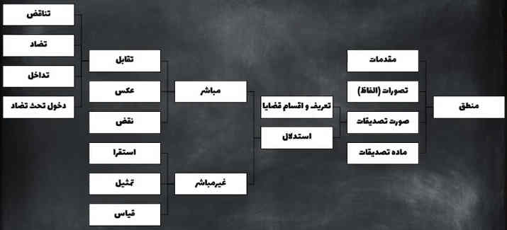
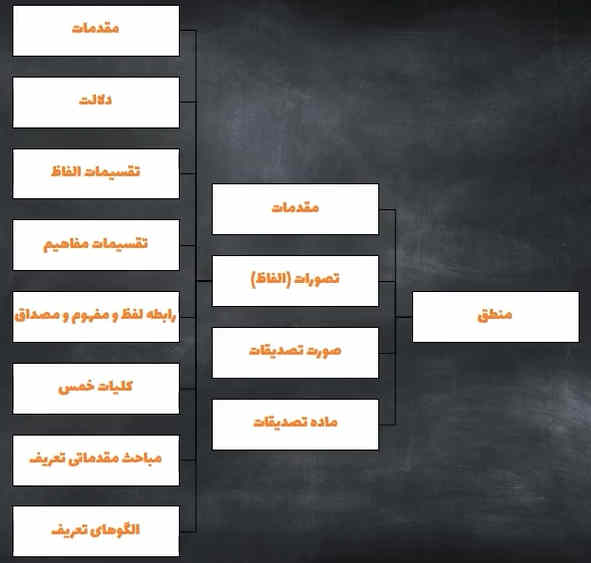

*

تعریف‌منطق: قوانین و معیار در تفکر صحیح که سبب جلوگیری از خطا در تفکر شود برای ۱-تعریف و ۲-استدلال

* منطق با این سه حوزه سروکار دارد
    * تعریف(تصور) به لحاظ صوری
    * استدلال(تصدیق) به لحاظ صوری
    * استدلال(تصدیق) به لحاظ مادی
* منطق بیشتر با «کل» سروکار دارد
   * نسبت به «جزء» بسیار کمتر سروکار دارد
* موارد زیر در دایره علم منطق نمی‌گنجد
    * علم حضوری
    * علم حصولی بدیهی
    * مباحث مادی تعریف نظری
* منطق مستقیما با الفاظ کار ندارد(برخلاف «صرف‌ونحو» که مستقیما با الفاظ سروکار دارند)
* منطق با معانی و ادراک ذهنیه کار دارد
* سوفِسطائیان: از ایجاد «خطا فکر» برای مقاصد خود بهره می‌بردند و حقایق را مطابق میل خود جلوه میدادند
* «رئوس‌ثمانیه» هشت مطلب در بیان هر علم ۱-تعریف‌علم ۲-فایده ۳-موضوع ۴-مرتبه:جایگاه آن علم در میان علوم دیگر ۵-ارزش* ۶-واضع* ۷-وجه‌تسمیه(سِمَت) ۸-نمونه‌ای از مباحث آن علم
    * برخی بدین گونه گفتند: ۱-وجه‌تسمیه(سِمَت) ۲-مؤلف ۳-غرض ۴-منفعت ۵-مرتبه:جایگاه آن علم در میان علوم دیگر ۶-جنس ۷-قسمت تعلیم علم ۸-روش تعلیم علم

# 🅰️ تعاریف اولیه

* «صوری»:صورت یا همان قالب 
* «مادی»:محتوای یک قالب 
   * «تعریف‌به‌لحاظ‌مادی»:  برخی همانند «خواجه‌نصیرالدین‌طوسیس» موافق این انتقال نیستند. تنها بخاطر ملاحظاتی از کتب منطقی به کتب فلسفی منتقل شده است
* «وجود اشیاء»: یک شیء میتواند در حالات زیر وجود داشته باشد
  1. وجود جسم خارجی شیء(مثل جسم خارجی مداد که ممکن است بشکند و تراش شود)
  2. وجود صورت ذهنی شیء(مثل صورت ذهنی از مداد)
  3. وجود لفظی شیء(آوایی از شیء که از دهان خارج میشود[زبانهای متفاوت:مداد-pen-قلم])
  4. وجود نوشتاری شیء(با چند خط و منحنی قرار داد می شود که مداد متصور گردد)

## 🅱️ علم

علم: صورتی از معلوم در ذهن(منطق) + حضور و احاطه پیدا کردن بر شئ + نقطه مقابل جهل + درک رابطه‌های اشیاء

* «موضوع علم»: چیزی که حول و عوارض آن گفتگو می‌شود(قضایا)
* علم حضوری: «حضور معلوم نزد عالم»[در منطق در این خصوص بحث نمیشود] مثل گرسنگی-درد-احساسات‌انسان-غم-شادی
    * در علم حضوری چیزی که علم به آن پیدا شده در وجود خود آدم است
* علم حصولی: «حضور صورت، معنا یا مفهومی از معلوم نزد عالم» بعبارتی «علمی که به واسطه حضور صورتی از شیء نزد عالم به وجود می‌آید»
    * بدیهی:«علومی که برای بدست آوردنشان **نیاز به اندیشیدن وجود ندارد**»(در منطق وارد نمی شود زیرا خطایی ندارد تا توسط منطق بررسی شود) مثل: ۱-فهم رنگ زرد با چشم ۲-فهم زبر بودن یک سطح زبر
    * نظری: «علومی که برای بدست آوردنشان نیاز به اندیشه دارد» 
        * «شناخت نظری»: معلوم نیست و باید با فکر به واسطه شیء دیگر درک شود واحتیاج به تشریح و توضیح دارد مثلا تصور از جن و ملک
* در یک نگاه
   * علم(۱۰۰درصد)
   * شکّ: (۵۰درصد در مقابل ۵۰درصد)
   * ظنّ: بیشتر از شکّ(مثلا ۷۰درصد در مقابل ۳۰ درصد) 

# 🅰️ تصدیق

تصدیق: صورت شیء در ذهن که قابلیت صدق و کذب دارد(قابلیت حکم داشته‌باشد)

* قضاوت ذهنی میان دو شیء که آیا شیء در شیء دیگر صدق می‌کند و نتیجه‌آن منجر به حکم می‌شود
* [علامه حلی در حوهر النضید] «تصوری که مستلزم با حکم است»
* نسبت صدق دادن همان تطابق دادن است
* «تصدیق های بدیهی» در دایره علم منطق بررسی نمی‌شود
* [بهروز]: در منطق نقطه آخر هر استدلال به تصدیق میرسد که باید منجر به حکم شود
* مثال:
  * حکم تصدیق(منطق): «هوا گرم است» که صورت‌ذهنی از «هوا» و صورت‌ذهنی از «گرما» هرکدام تصور است

# 🅰️ تصور

تصور: صورت شیء در ذهن که قابلیت صدق و کذب ندارد(قابلیت حکم نداشته‌باشد)

* «تصور جزئی»: فقط قابل انطباق بر شیء واحد باشد و شمارش‌پذیر(چندتا و کدامیک) نباشد. نظیر اسم‌ها خاص
* «تصور کُلی»: تعداد در آن مطرح است و قابل انطباق بر تعداد نامتناهی شیء است. مثل: تصور از انسان یا آتش یا شهر یا کوه
* «تصور بدیهی»: تصورات روشن و واضح بدون ابهام که نیاز به فکر نداشته باشد نظیر تصور از حرارت و برودت
* تصور مقدمه تصدیق است
* مثال
  * هر عبارتی(لزوما نباید حتما مفرد باشد بلکه عبارت نیز میتواند باشد)
  * جملات «امر و نهی» مثال: درب را باز کن.
  * جملات «پرسشی» مثال: آیا او خواهد آمد؟
  * جملات «تعجبی» مثال: واقعا آتشفشان فوران کرده است؟
  * ترکیبهای «وصفی»: مثال: آسمانِ زیبا
  * ترکیبهای «اضافی»: مثال:نورِخورشید

